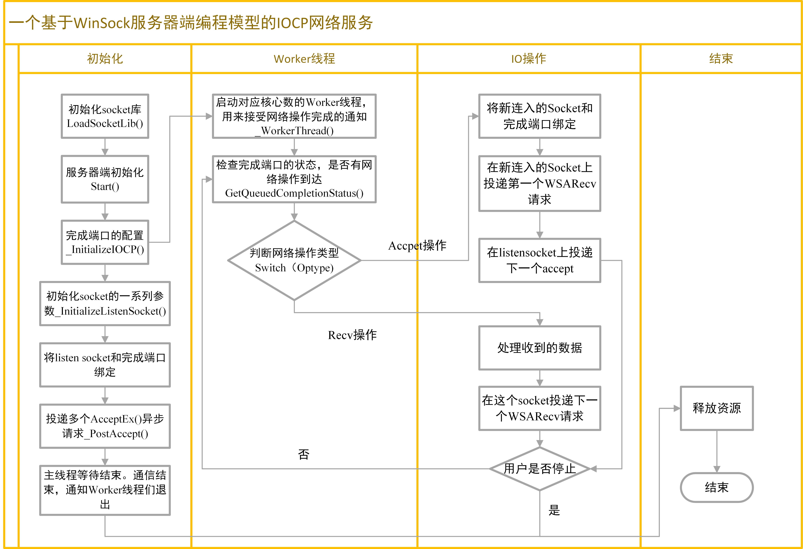

# server_by_IOCP_2.0

一个基于完成端口网络服务类，使用IOCP机制的缓存池，并且加入心跳包监测

这个类IOCP是本代码的核心类，用于说明WinSock服务器端编程模型中的 完成端口(IOCP)的使用方法，其中的IOContext类是封装了用于每一个重叠操作的参数， 具体说明了服务器端建立完成端口、建立工作者线程、投递Recv请求、投递Accept请求的方法， 所有的客户端连入的Socket都需要绑定到IOCP上，所有从客户端发来的数据，都会调用回调函数。
用法：派生一个子类，重载回调函数
Revised by Birdyhh at 2022/1

